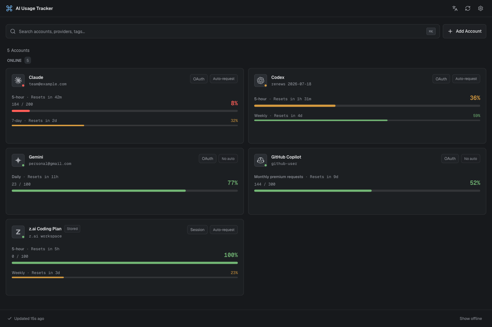

<div align="center">

# 🛰️ AI Usage Tracker

**Live, real subscription usage for your AI coding tools — right in the menu bar.**

No estimation. No proxy server. Tokens never leave your machine.

[](https://github.com/yakisoba0728/ai-usage-tracker/actions/workflows/ci.yml)




</div>

---

## What it is

A tiny [Tauri 2](https://tauri.app) desktop app that reads the credential each AI coding CLI **already stores on your machine**, calls that provider's *own* usage API, and shows your real remaining quota — 5-hour windows, weekly limits, reset timers — in your menu bar and a clean dashboard.

It never estimates from token counts and never routes your traffic through a server. Every provider call happens in Rust on your device; the webview only ever sees non-secret usage numbers.

## ✨ Highlights

- **🔌 6 providers, one dashboard** — Claude, Codex (ChatGPT), Gemini, GitHub Copilot, Cursor, and z.ai, rendered uniformly.
- **🎯 Real data only** — a window is omitted rather than guessed; a missing/expired token shows *why* and which CLI to run, never a fake number.
- **🔐 Tokens stay in Rust** — only masked `{id, provider, label}` + usage snapshots cross the IPC boundary; access/refresh tokens are never serialized to the UI. The webview CSP pins `connect-src` to IPC, so all provider HTTP runs in Rust.
- **🪟 Native menu-bar tray** — a real OS tray menu (macOS `NSMenu` / Windows system tray), rebuilt on every refresh, showing each provider's **remaining headroom** (a fresh plan reads 100%).
- **🔁 Two ways to connect** — auto-detect a CLI's local credential, or **Add account** in-app (paste a key, or a browser/device-code OAuth flow using the CLI's *public* `client_id`).
- **⏱️ Window anchoring (opt-in)** — send a minimal message to start a fresh 5-hour window at a predictable time, per account (Claude / Codex / z.ai).
- **🌐 i18n** — English + 한국어, auto-detected and toggleable.
- **🖥️ macOS + Windows** — Windows is CI-compile-verified (Linux is not a target).

## 🧩 Supported providers

| Provider | Connect | Refresh |
|---|---|---|
| **Claude** | Claude Code credential (auto) · session-key paste (manual) | OAuth self-refresh; rotated tokens written back |
| **Codex** (ChatGPT) | Codex CLI `auth.json` (auto) · browser OAuth (manual) | OAuth self-refresh |
| **Gemini** | **In-app OAuth only** (Add account) | OAuth self-refresh |
| **GitHub Copilot** | Copilot CLI credential (auto) · device-code OAuth / pasted token (manual) | None — `gho_`/`ghu_`/`github_pat_` are non-expiring |
| **Cursor** *(experimental)* | local `state.vscdb` (auto-only) | No public refresh path |
| **z.ai** (GLM Coding Plan) | `ZAI_API_KEY` env / pasted key | None — long-lived key |

<details>
<summary><b>Exact endpoints & credential locations</b></summary>

| Provider | Credential source | Usage endpoint | Refresh detail |
|---|---|---|---|
| **Claude** | macOS Keychain `Claude Code-credentials` / `~/.claude/.credentials.json` (auto); session-key paste (manual) | `api.anthropic.com/api/oauth/usage` + `/api/oauth/profile`; session-key accounts use `claude.ai/api/organizations[/{uuid}/usage]` | Self-refresh via `platform.claude.com/v1/oauth/token` (fallback `api.anthropic.com/v1/oauth/token`), reusing the public Claude Code client_id; tokens written back. Re-refreshed only on `401` — a `429` is a real quota signal and must not burn the rotating refresh token. |
| **Codex** | `~/.codex/auth.json` (`CODEX_HOME`) (auto); browser OAuth (manual) | `chatgpt.com/backend-api/wham/usage` with `ChatGPT-Account-Id` + a `codex_cli_rs/` User-Agent | Self-refresh via `auth.openai.com/oauth/token`, reusing the public Codex CLI client_id; rotated tokens written back to `auth.json`. |
| **Gemini** | **In-app browser OAuth only** (CLI auto-detect dropped — the CLI encrypts/migrates its token store) | Google Code Assist `loadCodeAssist` / `retrieveUserQuota` | Self-refresh via `oauth2.googleapis.com/token`. Login uses Authorization Code + loopback redirect (Google's installed-app client_id has no device-code grant). |
| **GitHub Copilot** | macOS Keychain `copilot-cli` / `~/.copilot/config.json` (`COPILOT_HOME`) (auto); device-code OAuth or pasted token (manual) | `api.github.com/copilot_internal/user` with `Editor-Version` / `Editor-Plugin-Version` / `Copilot-Integration-Id` headers | None. Accepts `gho_`, `ghu_`, `github_pat_` (with the **Copilot Requests** permission). Classic `ghp_` PATs are **not** supported. |
| **Cursor** | `state.vscdb` → `ItemTable[cursorAuth/accessToken]` (auto-only) | Connect-RPC `api2.cursor.sh/aiserver.v1.DashboardService/GetCurrentPeriodUsage` | None. |
| **z.ai** | `ZAI_API_KEY` env (auto); pasted API key (manual) | `api.z.ai/api/monitor/usage/quota/limit` (5h + weekly) | None. |

</details>

### Platform support (macOS + Windows)

> **Linux is not a supported target.** Where each CLI's credential is read, per OS:

| Provider | macOS | Windows |
|---|---|---|
| **Claude** | Keychain `Claude Code-credentials` → file | `%USERPROFILE%\.claude\.credentials.json` (+ `%CLAUDE_CONFIG_DIR%`) |
| **Codex** | `~/.codex/auth.json` (+ `CODEX_HOME`) | `%USERPROFILE%\.codex\auth.json` (+ `%CODEX_HOME%`) |
| **Gemini** | OAuth only (Add account) | OAuth only (Add account) |
| **Copilot** | Keychain `copilot-cli` → file | Credential Manager `copilot-cli` → `%USERPROFILE%\.copilot\config.json` ¹ |
| **Cursor** | `~/Library/.../Cursor/.../state.vscdb` | `%APPDATA%\Cursor\User\globalStorage\state.vscdb` |
| **z.ai** | `ZAI_API_KEY` / pasted key | `ZAI_API_KEY` / pasted key |

¹ The Windows keyring account name is best-effort (`cmdkey /list` to verify). Windows is **CI-compile-verified**; live runtime (tray, real credential reads, anchor send) is not yet hardware-tested.

## 🚀 Quick start

```bash
pnpm install
pnpm tauri dev        # launch the app + tray with Vite HMR
```

Auto-detection just needs the relevant CLI signed in (it owns the local credential):

```bash
# Claude  — `claude` then /login
# Codex   — `codex login`
# Gemini  — Add account → browser OAuth (in-app)
# Copilot — `copilot login`   (the Copilot CLI, NOT `gh`)
# Cursor  — sign in to the Cursor app
# z.ai    — export ZAI_API_KEY=...
```

For anything without a CLI, use **Add account** in the dashboard.

### Build

```bash
pnpm tauri build      # → src-tauri/target/release/bundle/{macos/*.app, dmg/*.dmg, ... / Windows nsis·msi}
```

The `tauri` npm script is a cross-platform Node wrapper that strips the ambient `CI` env var before invoking the Tauri CLI. Release signing / notarization is a separate, not-yet-configured pipeline.

### Test

```bash
cd src-tauri && cargo test --lib    # Rust unit tests
pnpm test                           # frontend unit tests (vitest)
pnpm exec tsc --noEmit              # type-check
pnpm verify:runtime                 # lint + type-check + vitest + Rust unit tests
pnpm verify:release                 # frontend build + debug Tauri no-bundle smoke
```

CI (`.github/workflows/`) runs the frontend type-check + vitest, and `cargo test --lib` across a **macOS + Windows** matrix on every push/PR (`fmt`/`clippy` on macOS); `build-smoke.yml` does a debug `tauri build` on both.

## 🔒 Privacy & security

- **On-device only.** No proxy, no telemetry. Each provider's URL/headers mirror its reference implementation; the app calls the real usage API directly.
- **Tokens stay in Rust.** Access/refresh tokens are never sent to the webview (P0 invariant). Provider raw responses are omitted from IPC by default; `AIT_DEBUG_RAW_RESPONSE=1` enables a redacted diagnostic copy.
- **Plaintext account store.** User-added credentials live in a local `accounts.json` in the app config dir (plaintext at rest — the OS-keychain backing was dropped because the unsigned build re-prompted for the login password on every poll). On POSIX, the app writes the directory/file owner-only (`0700`/`0600`). On Windows, files inherit the user's profile/app-data ACL; the app does not currently rewrite Windows ACLs.
- **Reuse-only client_ids.** In-app OAuth/refresh reuses each CLI's *public* `client_id`; the app registers no OAuth client of its own.
- **Per-provider isolation.** One failing provider never breaks the others or the scheduler (`panic = "abort"` is deliberately not set).

## 🏗️ Architecture

```
React + TS + Tailwind + shadcn/ui  ──IPC──▶  Rust (Tauri 2)
                                            ├─ commands    (#[tauri::command] surface + refresh_once)
                                            ├─ scheduler   (generation-guarded poll loop; parallel fetch_all)
                                            ├─ providers   (ProviderApi trait: claude/codex/gemini/copilot/cursor/zai)
                                            ├─ anchor      (window-anchoring: minimal message send, Rust-only)
                                            ├─ oauth_login (browser + localhost-callback OAuth)
                                            ├─ store       (accounts.json — user-added credentials)
                                            ├─ secrets     (read other CLIs' creds: Keychain/Cred-Manager + JSON + SQLite)
                                            ├─ http        (shared reqwest client + sanitizing JSON helpers)
                                            └─ config      (AppConfig persistence)
```

- **Frontend is provider-agnostic** — one `ServiceUsage` shape renders every provider; adding one is a TS union entry + an SVG mark.
- **Remaining-headroom display** — cards, detail windows, and the tray all show `100 − used` (a fresh plan = 100%); severity colors stay keyed off *used*.
- **Window anchoring (opt-in, off by default)** — for the rolling 5-hour window, **Claude / z.ai / Codex** send a minimal message (per-account auto toggle when the window is empty, or a confirmed manual button) so the reset time stays predictable; entirely in Rust. Copilot/Gemini (calendar quotas) and Cursor (no send path) are shown as **not supported**. These consume real quota and may be subject to each provider's terms.
- **Closing the window** hides it to the tray; the app keeps polling (every 5 minutes by default).

## ⚙️ Configuration

`AppConfig { poll_seconds (≥ 30), providers: [ProviderConfig; 6], auto_anchor }` in the canonical order `[Claude, Codex, Gemini, Copilot, Cursor, z.ai]`. Each `ProviderConfig`: `enabled`, `custom_name`, `notify_thresholds` (in-app toast levels), `primary_window` (pin the card headline), `sort_index`. `auto_anchor` is a per-account opt-in map for window anchoring.

## 📚 References (API contracts ported to Rust)

- **Claude** — [`m13v/claude-meter`](https://github.com/m13v/claude-meter) (MIT)
- **Gemini** — [`wakamex/gemini-cli-usage`](https://github.com/wakamex/gemini-cli-usage) (MIT) + Gemini CLI `oauth2.ts`
- **Codex** — [`openai/codex`](https://github.com/openai/codex) `codex-rs/{backend-client,login}` (Apache-2.0)
- **Copilot** — [`vbgate/opencode-mystatus`](https://github.com/vbgate/opencode-mystatus) (MIT) + Copilot extension headers
- **Cursor** — [`ClearMeasureLabs/cursor-usage-status`](https://github.com/ClearMeasureLabs/cursor-usage-status) (MIT)
- **z.ai** — community `quotas` crate + `vscode-zai-usage` (endpoint is community-documented)

## 📋 Status & limitations

- v1 ships live current values only — no history/trends.
- Each CLI still owns *initial* token issuance; an in-app account reuses the CLI's public `client_id`, so it counts as "logged in via that CLI."
- macOS is the primary dev/test platform; **Windows is CI-compile-verified but not yet hardware-tested**; **Linux is not supported.**
- The z.ai usage endpoint is undocumented and may change without notice.

---

<div align="center">
<sub>Built with Tauri 2 · React 19 · Rust. The dashboard above runs on demo data.</sub>
</div>
